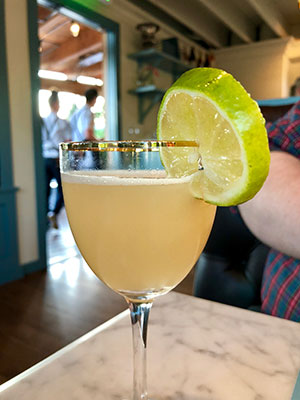

# Cocktails

This goal of this project was to create a quick prototype that is inspired by the following photo. Using HTML (Pug), CSS (SCSS), and Javascript, I built what is essentially a cocktail maker. Hey, cheers!

Prototype link: https://hexagoncircle.com/cocktails

## How's it work?

The current iteration of this project gives you three drinks to choose from. When a drink is selected, the cocktail data is fetched from a `drinks` object containing all of the components that make up the cocktail (name, ingredients, garnishes, glass type, and more). The ingredients of the cocktail will be "poured" into the glass one by one. *Recommended:* make one of these cocktails at home and enjoy it while enjoying this project.

## Todo

So much! There was a time limit set on this project so it's somewhat limited at the moment. Visit the [issue queue](https://github.com/hexagoncircle/cocktails/issues) to see future enhancements and bugs that need to be fixed.

## Contribute

Do you imagine this becoming something bigger? Have some nifty ideas? Add them [here](https://github.com/hexagoncircle/cocktails/issues)!

## License

Use this repo code however you'd like.
